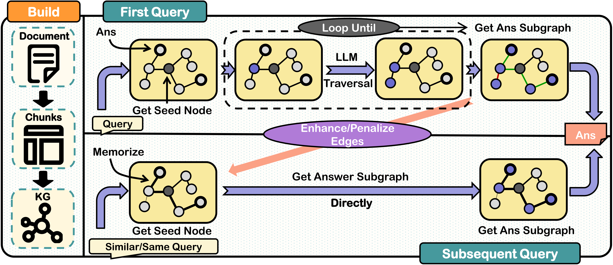

<center><h1>ReMindRAG: Low-Cost LLM-Guided Knowledge Graph Traversal</h1></center>


<div style="text-align:center">
  
</div>

### ​​ReMindRAG (Retrieve and Memorize)​​ enhances RAG systems by leveraging LLM-guided knowledge graph traversal for efficient, fine-grained retrieval. 

Unlike traditional methods, it resolves long dependencies and multi-hop reasoning while minimizing computational overhead. By memorizing traversal paths without additional training, ReMindRAG boosts accuracy and reduces retrieval costs for similar queries. Experiments show superior performance in complex tasks—especially multi-hop reasoning and long-range dependencies—with improved robustness, adaptability, and cost efficiency compared to existing approaches.

## Installation

### Initialize Environment

Use this command to initialize this Repo's environment.
```shell
    conda create -n ReMindRag python==3.13.2
    conda activate ReMindRag
    pip install -r requirements.txt
```

## Quick Start

### Preparation

Replace with your OpenAI API key by filling in the `api_key.json` file:

```json
[
    {
        "base_url": "your_api_key_url",
        "api_key": "your_api_key"
    }
]
```

Download the HuggingFace model [nomic-ai/nomic-embed-text-v2-moe](https://huggingface.co/nomic-ai/nomic-embed-text-v2-moe) and place it in the `./model_cache` directory.

Load your HuggingFace token:

```shell
$env:HF_TOKEN = "hf_YourTokenHere"
```


### Run Example

In the `example` folder, we provide a demo. Use the following command to run this example:
```shell
    cd example
    python example.py
```

## Parameter Configuration
<details>
<summary>Initialization Parameters</summary>

| Parameter                      | Type | Default     | Description |
|--------------------------------|--------|------------------|-------------|
| `edge_weight_coefficient` | Float | 0.1              | Adjusts system's reliance on edge embedding for strong links (range 0.1-0.2) |
| `strong_connection_threshold` | Float | 0.55           | Below 0.775 theoretically; practical range 0.5-0.75 balances retrieval cost and memory capacity |
| `synonym_threshold` | Float | 0.7             | Merges entities when embedding similarity exceeds this value |
| `database_description` | Str | None           | A brief one-sentence description of your data |  
| `save_dir` | Str | None           | Your data storage path |  
| `logger_level` | Int | None           | Logger level based on logging (Level 5 is "Trace," the lowest level we set) |  
| `log_path` | Str | None           | Your log storage path |

</details>

<details>
<summary>Query Parameters</summary>

| Parameter                      | Type | Default    | Description |
|--------------------------------|--------|------------------|-------------|
| `max_jumps`          | Int | 10               | Controls nodes expanded during subgraph queries |
| `max_split_question_num` | Int | 1               | Maximum sub-questions from semantic decomposition (Set 1 to skip question split) |
| `search_key_nums`    | Int | 2                | Number of seed nodes in query initialization |
| `system_prompt`    | Str | None              | System prompt (if not set, our default system prompt will be used) |  
| `force_do_rag`    | Bool | False                | If set to False, the system will automatically decide whether to perform the RAG process |  
| `do_update`    | Bool | True                | If set to False, the memory function will be disabled for this query |

</details>


## Use Your Own Core Components

In **ReMindRAG**, apart from the core modules, other components are highly customizable. We provide a minimal example in `example/example.py`. You can refer to the following methods to use your own custom components.


<details>
<summary>Use Your Own Language Model</summary>

For all language models that use the OpenAI-compatible API format, please use the following code:

```python
from ReMindRag.llms import OpenaiAgent
agent = OpenaiAgent("your_api_key_url", "your_api_key", "your model name")
```

If you want to use another method to call your LLM, please subclass the **AgentBase** class in `ReMindRag/llms/base.py`.

</details>


<details>
<summary>Use Your Own Embedding Model</summary>

For all embedding models using the OpenAI-compatible API format, use the following code:

```python
from ReMindRag.embeddings import OpenaiEmbedding
embedding = OpenaiEmbedding("your_api_key_url", "your_api_key", "your model name")
```

For all embedding models using HuggingFace's SentenceTransformer, use the following code:

```python
from ReMindRag.embeddings import HgEmbedding
embedding = HgEmbedding("your model name", "your model cache dir")
```

If you want to use another embedding model access method, please subclass the **EmbeddingBase** class in `ReMindRag/embeddings/base.py`.

</details>


<details>
<summary>Use Your Own Chunk Function</summary>

For the most basic token-based chunking, use the following code:

```python
from ReMindRag.chunking import NaiveChunker
chunker = NaiveChunker("your tokenizer name", "your tokenizer cache dir", max_token_length=your_chunk_size)
```

If you want to implement a different chunking strategy, please subclass the **ChunkerBase** class in `ReMindRag/chunking/base.py`.

</details>


## Evaluation
<details>
<summary>Code & Steps</summary>

**Step 1**: Download the LooGLE dataset and our modified dataset, then place them in `eval/database`.

**Step 2**: Download the HuggingFace model [nomic-ai/nomic-embed-text-v2-moe](https://huggingface.co/nomic-ai/nomic-embed-text-v2-moe) and place it in the `./model_cache` directory.

**Step 3**: Load your HuggingFace token:

```shell
$env:HF_TOKEN = "hf_YourTokenHere"
```

**Step 4**: Run the following commands to test ReMindRAG.

```shell
cd eval
python start_LooGLE.py --test_name "eval-long" --data_type "longdep_qa"
python start_LooGLE.py --test_name "eval-simple" --data_type "shortdep_qa"
python start_Hotpot.py --test_name "eval-multihop"
```

For more parameters, use the "--help" command.

</details>


## Code Structure
<details>
<summary>Code Structure</summary>

```
📂 ReMindRag
├──  📂 ReMindRag
│   ├──  🐍 rag_main.py         # Main entry file for ReMindRag
│   ├──  🧩 chunking
│   │   ├──  🐍 base.py         # All text chunking methods must inherit from the class in this file
│   │   └──  ...... 
│   ├──  🤖 llms
│   │   ├──  🐍 base.py         # All large language model interfaces must inherit from the class in this file
│   │   └──  ...... 
│   ├──  📝 embeddings
│   │   ├──  🐍 base.py         # All embedding methods must inherit from the class in this file
│   │   └──  ...... 
│   ├──  🗃️ database
│   │   ├──  🐍 chromaDB.py     # Database operations based on ChromaDB
│   │   ├──  🐍 data_extract.py # Code for extracting named entities and relationships
│   │   └──  🐍 prompts.py      # Prompts used for extracting named entities and relationships
│   ├──  🛠️ generator
│   │   ├──  🐍 preprocess.py   # Query preprocessing related code
│   │   ├──  🐍 pathfinder.py   # Core code for LLM-Guided Traversal
│   │   └──  🐍 prompts.py      # Prompts used in LLM-Guided Traversal
│   ├──  🕸️ kg                  # Knowledge graph visualization related code
│   ├──  🧰 utils               # Utility components used in the project
│   └──  🖥️ webui
│       ├──  📂 templates       # Webpage templates used by the web UI
│       └──  🐍 webui.py        # Main entry code for the web UI
├──  📜 api_key.json            # JSON file for storing API keys (optional)
├──  📂 eval                    # Evaluation code for ReMindRag
├──  📂 example                 # Example code for ReMindRag
└──  ......

```

</details>
